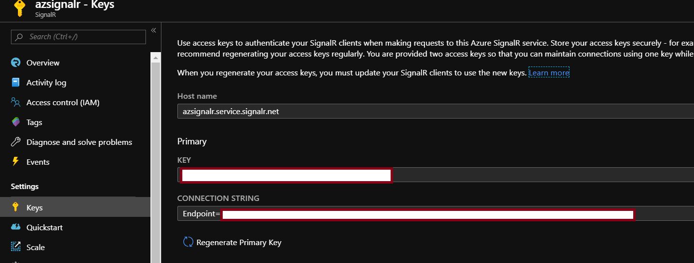

# Azure SignalR Services - Angular Integration

## Flow Diagram


## Azure Function - GetAzureSignalRConnection

This is required to get the azure signal r connection information. Be specific on the function name, it has to be negotiate. This function will be used in subscriber app. It will supply the azure signal R connectionstring to the subscriber app. 

```csharp
public static class GetAzureSignalRConnection
    {
        [FunctionName("negotiate")]
        public static async Task<IActionResult> Run(
            [HttpTrigger(AuthorizationLevel.Anonymous, "get", "post", Route = null)] HttpRequest req,
            [SignalRConnectionInfo(HubName = "broadcast")]SignalRConnectionInfo signalRConnectionInfo,
            ILogger log)
        {
            return (ActionResult)new OkObjectResult(signalRConnectionInfo);
        }
    }
```

## Azure Function - SendMessage

This function is used by the publisher app to broadcast message to multiple subscriber apps.

```csharp
[FunctionName("message")]
        public static async Task<IActionResult> Run(
            [HttpTrigger(AuthorizationLevel.Anonymous, "post", Route = null)] HttpRequest req,
            [SignalR(HubName = "broadcast")]IAsyncCollector<SignalRMessage> signalRMessages,
            ILogger log)
        {
            string requestBody = new StreamReader(req.Body).ReadToEnd();

            await signalRMessages.AddAsync(new SignalRMessage()
            {
                Target = "notify",
                Arguments = new object[] { requestBody }
            });

            return new OkResult();
        }
```

## Config File for Function App 

This will hold the azure signal R connectionstring. You can find the connectionstring from the portal below.



Define CORS details is really important, since our client application is angular.

```javascript
{
  "IsEncrypted": false,
  "Values": {
    "AzureWebJobsStorage": "UseDevelopmentStorage=true",
    "FUNCTIONS_WORKER_RUNTIME": "dotnet",
    "AzureSignalRConnectionString": "YOUR CONNECTIONSTRING"
  },
  "Host": {
    "LocalHttpPort": 7071,
    "CORS": "http://localhost:4200,http://localhost:4201",
    "CORSCredentials": true
  }
}
```

## Publisher App

This will publish message to the azure signal R service using message azure function.

```typescript

import { Injectable } from '@angular/core';
import { HttpClient } from "@angular/common/http";
import { Observable } from "rxjs";
import { map } from "rxjs/operators";
import { Subject } from "rxjs";

@Injectable()
export class MessageService {
  private readonly _http: HttpClient;
  constructor(http: HttpClient) {
    this._http = http;
}
    send(message: string): Observable<void> {
        let requestUrl = `http://localhost:7071/api/message`;
        return this._http.post(requestUrl, message).pipe(map((result: any) => { }));
    }
}
```

## Subscriber App

This will listen for the published message using a npm package @aspnet/signalr.

```typescript

import { Injectable } from "@angular/core";
import { HubConnection } from '@aspnet/signalr';
import * as signalR from '@aspnet/signalr';
import { Subject } from "rxjs";

export class SignalRConnectionInfo {
  url: string;
  accessKey: string;
  userId: string;
  idToken: string;
}

@Injectable()
export class signalRService {
  private hubConnection: HubConnection;
  messages: Subject<string> = new Subject();

  constructor() {

  }

   init() {
      this.hubConnection = new signalR.HubConnectionBuilder()
      .withUrl('http://localhost:7071/api')
      .configureLogging(signalR.LogLevel.Information)
      .build();

  this.hubConnection.start().catch(err => console.error(err.toString()));

  this.hubConnection.on('notify', (data: any) => {
      this.messages.next(data);
  });
  }

}
```

